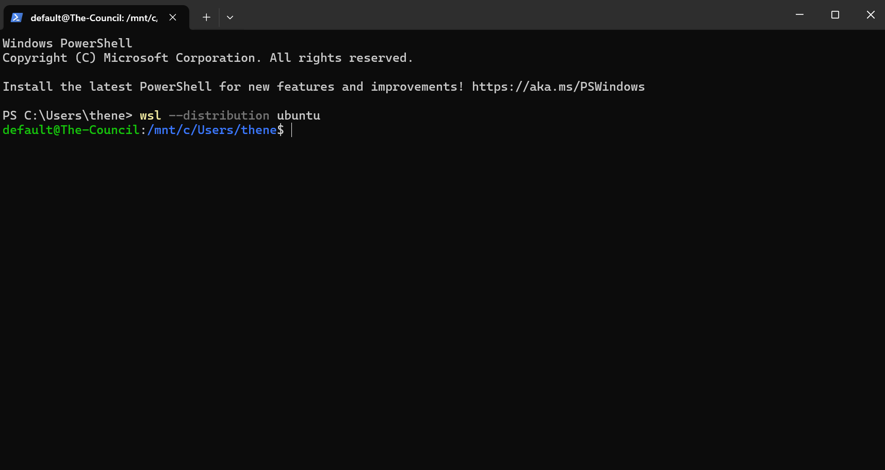

# ASTRA Base Station

Welcome! This is the repository for UAH's ASTRA Base Station for the University
Rover Challenge in 2025.

ASTRA is a project under the AutoSat branch of Space Hardware Club as part of
The University of Alabama in Huntsville.

## Development Platform Recommendations

Basestation development occurs in Visual Studio Code Docker development
containers. You can find setup instructions for Windows and Linux below.

## Running the Base Station

[See here.](scripts/README.md)

## Windows Setup

> [!CAUTION]
> Using Docker Engine directly in Windows will cause many issues, including
> increasing build times by up to 20x ([though some developers may prefer this](https://xkcd.com/303/)).

### Visual Studio Code in Windows

[Install Visual Studio Code (VSC).](https://code.visualstudio.com/download)

### Windows Subsystem for Linux (WSL)

To install WSL, run this in PowerShell:

```powershell
wsl --install -d Ubuntu
```

Use the arrow keys to navigate the installer. Pick a username and a password you
won't forget!

Once WSL is set up, you should have a Bash prompt that starts with a `$`. Use
this terminal to follow the Linux instructions below.

> [!NOTE]
> The distribution installed in WSL is Ubuntu, which you'll need to know for the
> Linux instructions below.

<details open>
 <summary>
  A properly set up WSL prompt.
 </summary>

Your prompt may look a bit different, but if it ends with a `$` then you're good
to go.



</details>

## Linux Setup

### Docker

> [!NOTE]
> Basestation now uses Docker for development!

Follow the instructions to [install Docker Engine on your system](https://docs.docker.com/engine/install/).

Run these commands:

```bash
# add current user to `docker` group
sudo usermod -aG docker $USER
# restart the shell with the new group list
exec newgrp docker
```

### Git and GitHub Setup

> [!NOTE]
> You'll need a GitHub account to contribute to Basestation's code.

First, ensure you have `git` installed:

```bash
which git
```

If `which` doesn't complain about not finding `git`, you're good to go.

Next, install [Github CLI](https://github.com/cli/cli/blob/trunk/docs/install_linux.md).

Generate an SSH key for use with GitHub:

```bash
ssh-keygen -t ed25519 -C "YOUR_EMAIL_HERE@example.com"  -f ~/.ssh/github
```

Tell SSH to use your key for github.com:

```bash
cat << EOF >> ~/.ssh/config 
Host github.com
        IdentityFile ~/.ssh/github
EOF
```

Check if you have an SSH agent running:

```bash
ssh-agent -l
```

If you get an error like
`Could not open a connection to your authentication agent.`, then follow these instructions:

<details>
 <summary>
  Set up SSH agent
 </summary>
 Run these commands:

 ```bash
 # modify .bashrc
 cat << EOF >> ~/.bashrc
 # start ssh agent
 eval \$(ssh-agent) > /dev/null
 # add github ssh key
 ssh-add -q ~/.ssh/github
 EOF
 
 # restart shell
 exec bash
 ```

</details>
<br />

Login to Github CLI:

```bash
gh auth login -p ssh -h github.com -w
```

* Select the SSH key you just generated
* Log in via web browser

> [!TIP]
> GitHub CLI might not be able to open your browser, depending on your system
> configuration. If you get an error, navigate to
> <https://github.com/login/device> and paste your one-time authentication code there.

Finally, clone the repository and submodules:

```bash
gh repo clone SHC-ASTRA/rover-Basestation-Release --recurse-submodules
```

### Visual Studio Code in Linux

[Install VSCode](https://code.visualstudio.com/docs/setup/linux). After
installation, run `code` in your terminal and then open up the repository you
just cloned with `File` > `Open Folder...`. The directory will be called `rover-Basestation-Release`.

> [!TIP]
> Use <kbd>Ctrl</kbd> + <kbd>Shift</kbd> + <kbd>P</kbd> to open the Command
> Palette in VSC.

Show the required extensions with `>Extensions: Show Recommended Extensions` in
the command palette. Make sure you install all of them!

Once installed, open up the dev container with
`>Dev Containers: Rebuild and Reopen in Container`.

If the dev container built and connected with no issues, you're all set.

## Contributors

For anyone adding to this repository, please add your name to the README before
making a pull request.

* Jamie Roberson
* Alexander Resurreccion
* Anshika Sinha
* Riley McLain
* Roald Schaum
