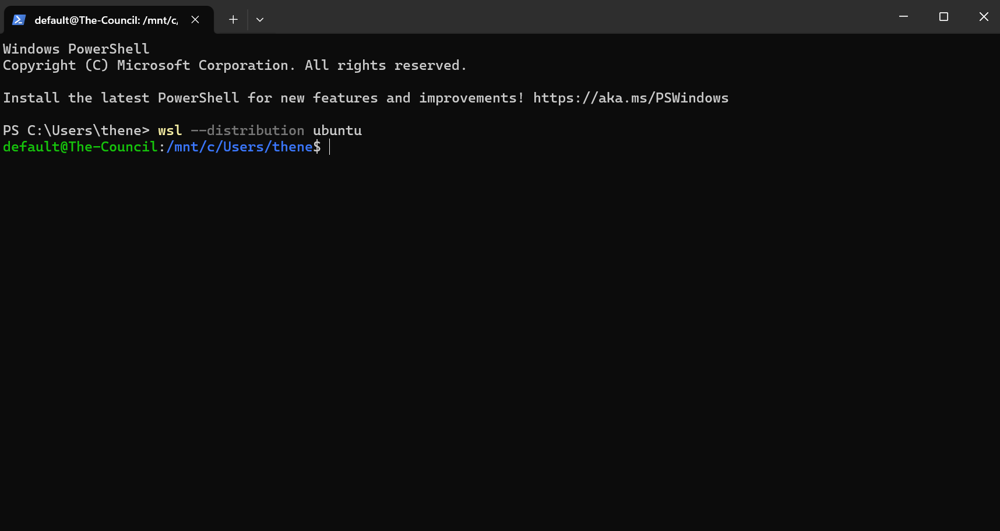

# Basestation Environment Setup

Basestation development occurs in Visual Studio Code Dev Containers. You can
find setup instructions for Windows and Linux below.

## Windows Setup

> [!WARNING]
> Using Docker Engine directly in Windows will cause many issues, including
> increasing build times by up to 20x ([though some developers may prefer this](https://xkcd.com/303/)).

### Visual Studio Code in Windows

[Install Visual Studio Code (VSC).](https://code.visualstudio.com/download)

### Git for Windows

[Install Git for Windows.](https://git-scm.com/downloads/win)
During installation, make to enable the following options:

- Git from the command line and also from 3rd-party software
- Use the OpenSSL library
- Checkout as-is, commit Unix-style line endings
- Fast-Forward or merge
- Git Credential Manager

### Windows Subsystem for Linux (WSL)

To install WSL, run this in PowerShell:

```powershell
wsl --install -d Ubuntu
```

Use the arrow keys to navigate the installer. Pick a username and a password you
won't forget! If prompted, go ahead and restart your computer.

> [!TIP]
> You can reopen WSL by launching it from the search feature in Windows.

Once WSL is set up, you should have a Bash prompt that starts with a `$`. Use
this terminal to follow the Linux instructions below.

> [!NOTE]
> The distribution installed in WSL is Ubuntu, which you'll need to know for the
> Linux instructions below.

<details open>
 <summary>
  A properly set up WSL prompt.
 </summary>

Your prompt may look a bit different, but if it ends with a `$` then you're good
to go.



</details>

## Linux Setup

### Docker

> [!NOTE]
> Basestation now uses Docker for development!

Follow the instructions to [install Docker Engine on your system](https://docs.docker.com/engine/install/).

Run these commands:

```bash
# add current user to `docker` group
sudo usermod -aG docker $USER
# restart the shell with the new group list
exec newgrp docker
```

### Git and GitHub Setup

> [!NOTE]
> You'll need a GitHub account to contribute to Basestation's code.

First, ensure you have `git` installed:

```bash
which git
```

If `which` doesn't complain about not finding `git`, you're good to go.

Next, install [Github CLI](https://github.com/cli/cli/blob/trunk/docs/install_linux.md).

Generate an SSH key for use with GitHub:

```bash
# ensure the proper directory exists
mkdir -p ~/.ssh
# generate the key
ssh-keygen -t ed25519 -C "YOUR_EMAIL_HERE@example.com"  -f ~/.ssh/github
```

> [!TIP]
> If you don't want to set a password for your SSH key, just leave it blank and
> press enter.

Tell SSH to use your key for github.com:

```bash
cat << EOF >> ~/.ssh/config 
Host github.com
        IdentityFile ~/.ssh/github
EOF
```

Check if you have an SSH agent running:

```bash
ssh-add
```

If you get an error like
`Could not open a connection to your authentication agent.`, then follow these instructions:

<details>
 <summary>
  Set up SSH agent
 </summary>
 Run these commands:

 ```bash
 # modify .bashrc
 cat << EOF >> ~/.bashrc
 # start ssh agent
 eval \$(ssh-agent) > /dev/null
 # add github ssh key
 ssh-add -q ~/.ssh/github
 EOF
 
 # restart shell
 exec bash
 ```

</details>
<br />

Login to Github CLI:

```bash
gh auth login -p ssh -h github.com -w
```

- Select the SSH key you just generated
- Log in via web browser

> [!WARNING]
> GitHub CLI might not be able to open your browser, depending on your system
> configuration. If you get an error, navigate to
> <https://github.com/login/device> and paste your one-time authentication code there.

Finally, clone the repository and submodules:

```bash
gh repo clone SHC-ASTRA/rover-Basestation-Release -- --recurse-submodules --remote-submodules
```

> [!WARNING] WSL Warning
> Make certain you are **not** cloning to a Windows folder! Windows folders have
> paths starting with `/mnt/c`. You can get to your Linux home directory with `cd`.

### Visual Studio Code in Linux

> [!NOTE]
> We recommend you install the Snap version for simplicity's sake.

[Install VSCode](https://code.visualstudio.com/docs/setup/linux#_snap). After
installation, open the project in VSC:

```bash
code ~/rover-Basestation-Release
```

> [!TIP]
> Use <kbd>Ctrl</kbd> + <kbd>Shift</kbd> + <kbd>P</kbd> to open the Command
> Palette in VSC.

Show the required extensions with `>Extensions: Show Recommended Extensions` in
the command palette. Make sure you install all of them! It is possible that you
will not get recommended any extensions. If this is the case, install the
extension `ms-vscode-remote.remote-containers`.

Once installed, open up the dev container with
`>Dev Containers: Rebuild and Reopen in Container`.

If the dev container built and connected with no issues, you're all set.
